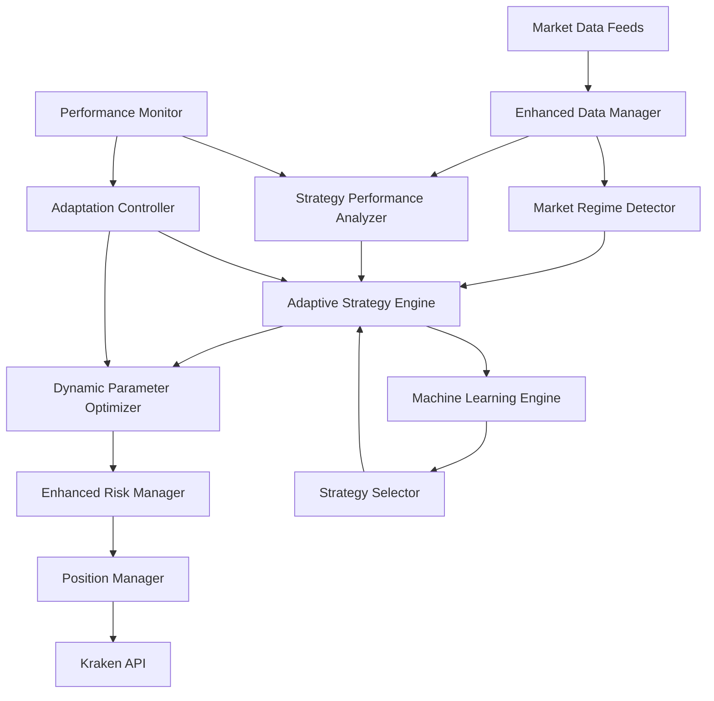

# Design Document

## Overview

The Adaptive Algorithmic Trading Bot is an advanced trading system that dynamically adapts its strategies, parameters, and behavior based on real-time market conditions and historical performance. It builds upon the existing enhanced trading infrastructure to create a self-improving system that can respond to changing market environments while maintaining strict risk controls.

The system uses machine learning techniques, market regime detection, and continuous performance feedback to optimize trading decisions. It operates as an intelligent layer above the existing enhanced strategies, data management, and risk management systems.

## Architecture

### High-Level Architecture



### Core Components

1. **Adaptive Strategy Engine**: Central orchestrator that manages strategy selection and execution
2. **Market Regime Detector**: Identifies current market conditions (trending, ranging, volatile, etc.)
3. **Machine Learning Engine**: Learns from historical data and trading outcomes
4. **Dynamic Parameter Optimizer**: Continuously optimizes strategy parameters
5. **Strategy Performance Analyzer**: Tracks and evaluates strategy effectiveness
6. **Adaptation Controller**: Controls the rate and scope of adaptations

## Components and Interfaces

### 1. Market Regime Detector

**Purpose**: Identify current market conditions to inform strategy selection.

**Key Methods**:
- `detect_regime(market_data: pd.DataFrame) -> MarketRegime`
- `get_regime_confidence() -> float`
- `get_regime_history() -> List[MarketRegime]`

**Market Regimes**:
- TRENDING_BULL: Strong upward trend
- TRENDING_BEAR: Strong downward trend  
- RANGING: Sideways movement within bounds
- HIGH_VOLATILITY: Elevated volatility across timeframes
- LOW_VOLATILITY: Compressed volatility, potential breakout
- UNCERTAIN: Mixed signals, low confidence

**Implementation**:
- Uses multiple timeframe analysis (5m, 15m, 1h, 4h)
- Combines trend indicators (ADX, moving averages)
- Volatility measures (ATR, Bollinger Band width)
- Volume analysis and momentum indicators
- Machine learning classification for regime prediction

### 2. Adaptive Strategy Engine

**Purpose**: Core engine that selects and executes strategies based on current conditions.

**Key Methods**:
- `select_optimal_strategy(pair: str, regime: MarketRegime) -> Strategy`
- `execute_adaptive_signal(pair: str, market_data: pd.DataFrame) -> TradingSignal`
- `update_strategy_weights(performance_data: Dict) -> None`
- `get_strategy_allocation() -> Dict[str, float]`

**Strategy Selection Logic**:
- Maintains a portfolio of strategies with dynamic weights
- Uses ensemble methods to combine multiple strategy signals
- Adapts strategy allocation based on recent performance
- Implements strategy switching with hysteresis to avoid whipsaws

### 3. Machine Learning Engine

**Purpose**: Learn from trading history to improve decision-making.

**Key Methods**:
- `train_models(historical_data: pd.DataFrame, trade_outcomes: List[Trade]) -> None`
- `predict_trade_outcome(signal: TradingSignal, market_conditions: Dict) -> float`
- `update_online(trade_result: TradeResult) -> None`
- `get_model_confidence() -> float`

**ML Models**:
- **Random Forest**: For regime classification and feature importance
- **Gradient Boosting**: For trade outcome prediction
- **Online Learning**: Incremental updates with new trade data
- **Ensemble Methods**: Combine multiple models for robustness

**Features Used**:
- Technical indicators (RSI, MACD, Bollinger Bands, etc.)
- Market microstructure (bid-ask spread, order book depth)
- Volatility measures and momentum indicators
- Cross-asset correlations and market sentiment
- Time-based features (hour of day, day of week)

### 4. Dynamic Parameter Optimizer

**Purpose**: Continuously optimize strategy parameters based on performance feedback.

**Key Methods**:
- `optimize_parameters(strategy: Strategy, performance_window: int) -> Dict[str, float]`
- `update_parameter_bounds(strategy: Strategy, market_regime: MarketRegime) -> None`
- `get_optimization_history() -> List[OptimizationResult]`

**Optimization Techniques**:
- **Bayesian Optimization**: For efficient parameter space exploration
- **Genetic Algorithms**: For complex multi-parameter optimization
- **Walk-Forward Analysis**: Validate parameters on out-of-sample data
- **Regime-Specific Optimization**: Different parameters for different market conditions

**Parameters Optimized**:
- Stop-loss and take-profit levels
- Position sizing multipliers
- Indicator periods and thresholds
- Entry and exit timing parameters
- Risk management parameters

### 5. Strategy Performance Analyzer

**Purpose**: Track and evaluate the performance of individual strategies and the overall system.

**Key Methods**:
- `analyze_strategy_performance(strategy: str, timeframe: str) -> PerformanceMetrics`
- `calculate_risk_adjusted_returns() -> Dict[str, float]`
- `detect_performance_degradation() -> List[Alert]`
- `generate_performance_report() -> PerformanceReport`

**Metrics Tracked**:
- Return metrics (total return, annualized return, excess return)
- Risk metrics (Sharpe ratio, Sortino ratio, maximum drawdown)
- Trade statistics (win rate, average trade duration, profit factor)
- Market condition performance (performance by regime)
- Adaptation effectiveness (improvement from parameter changes)

### 6. Adaptation Controller

**Purpose**: Control the rate and scope of system adaptations to prevent overfitting.

**Key Methods**:
- `should_adapt(performance_metrics: PerformanceMetrics) -> bool`
- `get_adaptation_rate() -> float`
- `validate_adaptation(proposed_changes: Dict) -> bool`
- `rollback_adaptation(adaptation_id: str) -> None`

**Adaptation Controls**:
- **Minimum Performance Threshold**: Only adapt if performance drops significantly
- **Adaptation Frequency Limits**: Prevent too frequent changes
- **Confidence Requirements**: Only adapt when sufficient confidence in changes
- **Rollback Mechanism**: Revert changes if they don't improve performance
- **A/B Testing**: Test adaptations on subset of capital before full deployment

## Data Models

### MarketRegime
```python
@dataclass
class MarketRegime:
    regime_type: RegimeType
    confidence: float
    volatility_level: float
    trend_strength: float
    momentum: float
    detected_at: datetime
    supporting_indicators: Dict[str, float]
```

### AdaptiveSignal
```python
@dataclass
class AdaptiveSignal:
    base_signal: TradingSignal
    regime_context: MarketRegime
    ml_confidence: float
    strategy_weights: Dict[str, float]
    parameter_adjustments: Dict[str, float]
    adaptation_metadata: Dict[str, Any]
```

### PerformanceMetrics
```python
@dataclass
class PerformanceMetrics:
    total_return: float
    annualized_return: float
    sharpe_ratio: float
    sortino_ratio: float
    max_drawdown: float
    win_rate: float
    profit_factor: float
    avg_trade_duration: timedelta
    trades_count: int
    regime_performance: Dict[RegimeType, float]
    last_updated: datetime
```

### OptimizationResult
```python
@dataclass
class OptimizationResult:
    strategy_name: str
    old_parameters: Dict[str, float]
    new_parameters: Dict[str, float]
    performance_improvement: float
    confidence_score: float
    optimization_method: str
    validation_period: timedelta
    applied_at: datetime
```

### AdaptationEvent
```python
@dataclass
class AdaptationEvent:
    event_id: str
    event_type: AdaptationType
    trigger_reason: str
    changes_made: Dict[str, Any]
    expected_impact: float
    actual_impact: Optional[float]
    success: Optional[bool]
    timestamp: datetime
    rollback_available: bool
```

## Error Handling

### Graceful Degradation
- **ML Model Failures**: Fall back to traditional technical analysis
- **Data Quality Issues**: Use cached data or reduce position sizes
- **Parameter Optimization Failures**: Revert to last known good parameters
- **Regime Detection Failures**: Use conservative default regime assumptions

### Error Recovery
- **Automatic Rollback**: Revert recent adaptations if performance degrades
- **Circuit Breakers**: Halt adaptations if too many failures occur
- **Manual Override**: Allow manual intervention to disable adaptations
- **Health Monitoring**: Continuous monitoring of all system components

### Logging and Alerting
- **Detailed Logging**: All adaptations, decisions, and performance changes
- **Real-time Alerts**: Immediate notification of critical failures
- **Performance Alerts**: Warnings when performance degrades significantly
- **System Health Alerts**: Notifications about component failures

## Testing Strategy

### Unit Testing
- Individual component testing with mock data
- Strategy performance calculation validation
- Parameter optimization algorithm testing
- ML model training and prediction testing

### Integration Testing
- End-to-end signal generation and execution
- Data flow between components
- Error handling and recovery mechanisms
- Performance under various market conditions

### Backtesting Framework
- Historical simulation with realistic market conditions
- Walk-forward analysis for parameter optimization
- Regime-specific backtesting
- Monte Carlo simulation for robustness testing

### Live Testing
- Paper trading with full system integration
- A/B testing of adaptations
- Gradual rollout with increasing position sizes
- Continuous monitoring and validation

## Performance Considerations

### Computational Efficiency
- **Caching**: Cache expensive calculations (ML predictions, optimizations)
- **Parallel Processing**: Parallel strategy evaluation and parameter optimization
- **Incremental Updates**: Update models incrementally rather than full retraining
- **Resource Management**: Monitor and limit CPU/memory usage

### Latency Optimization
- **Pre-computed Features**: Calculate indicators in advance
- **Model Serving**: Use optimized model serving for fast predictions
- **Database Optimization**: Efficient storage and retrieval of historical data
- **Network Optimization**: Minimize API calls and data transfers

### Scalability
- **Modular Design**: Easy to add new strategies and indicators
- **Configuration-Driven**: Parameterize all aspects of the system
- **Multi-Pair Support**: Efficient handling of multiple trading pairs
- **Resource Scaling**: Ability to scale computational resources as needed

## Security and Risk Management

### Risk Controls
- **Position Limits**: Hard limits on position sizes and portfolio exposure
- **Drawdown Limits**: Automatic shutdown if drawdown exceeds thresholds
- **Adaptation Limits**: Bounds on how much parameters can change
- **Emergency Stops**: Manual and automatic emergency stop mechanisms

### Data Security
- **Secure Storage**: Encrypted storage of sensitive trading data
- **Access Controls**: Restricted access to system components
- **Audit Trails**: Complete logging of all system actions
- **Backup and Recovery**: Regular backups and disaster recovery procedures

### Model Security
- **Model Validation**: Rigorous testing before deploying new models
- **Adversarial Testing**: Test models against adversarial inputs
- **Model Monitoring**: Continuous monitoring of model performance
- **Rollback Capability**: Ability to quickly revert to previous models

## Monitoring and Observability

### Real-time Dashboards
- **System Health**: Component status and performance metrics
- **Trading Performance**: Live P&L, positions, and trade statistics
- **Adaptation Activity**: Recent adaptations and their impacts
- **Market Conditions**: Current regime and market indicators

### Alerting System
- **Performance Alerts**: Significant changes in trading performance
- **System Alerts**: Component failures or degraded performance
- **Risk Alerts**: Approaching risk limits or unusual market conditions
- **Adaptation Alerts**: Major system adaptations or failures

### Historical Analysis
- **Performance Attribution**: Breakdown of returns by strategy and regime
- **Adaptation History**: Track of all adaptations and their effectiveness
- **Market Analysis**: Historical regime detection and market patterns
- **Error Analysis**: Analysis of failures and their root causes