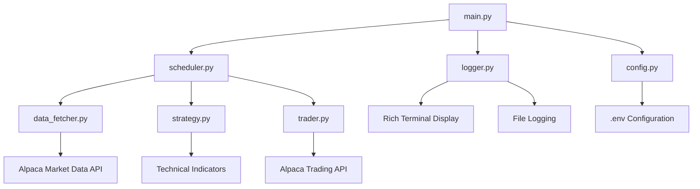

# Design Document

## Overview

The crypto trading bot is designed as a modular Python application that integrates with Alpaca's API for automated cryptocurrency trading. The system follows a clean architecture pattern with separated concerns for data fetching, strategy evaluation, trade execution, and logging. The bot operates on a scheduled interval basis, continuously monitoring BTC/USD markets and executing trades based on technical analysis signals.

The architecture emphasizes modularity, error resilience, and maintainability while providing real-time feedback through a rich terminal interface.

## Architecture

### High-Level Architecture



### Core Components Flow

1. **Initialization**: main.py loads configuration and initializes all components
2. **Scheduling**: scheduler.py triggers trading cycles every 5 minutes
3. **Data Pipeline**: data_fetcher.py retrieves OHLCV data from Alpaca
4. **Strategy Evaluation**: strategy.py analyzes data and generates signals
5. **Trade Execution**: trader.py executes buy/sell orders based on signals
6. **Logging & Display**: logger.py provides real-time feedback and persistence

## Components and Interfaces

### 1. Configuration Management (config.py)

**Purpose**: Centralized configuration and API credential management

**Key Classes**:
- `Config`: Singleton class managing all configuration
- `AlpacaCredentials`: Dataclass for API credentials
- `TradingSettings`: Dataclass for trading parameters

**Interface**:
```python
class Config:
    def __init__(self)
    def load_env_variables(self) -> bool
    def get_alpaca_credentials(self) -> AlpacaCredentials
    def get_trading_settings(self) -> TradingSettings
    def validate_config(self) -> bool
```

### 2. Data Fetching (data_fetcher.py)

**Purpose**: Retrieve and manage market data from Alpaca API

**Key Classes**:
- `DataFetcher`: Main class for data operations
- `MarketData`: Dataclass for OHLCV data structure

**Interface**:
```python
class DataFetcher:
    def __init__(self, credentials: AlpacaCredentials)
    def fetch_crypto_data(self, symbol: str, timeframe: str, limit: int) -> pd.DataFrame
    def get_latest_price(self, symbol: str) -> float
    def validate_data(self, data: pd.DataFrame) -> bool
    def handle_api_errors(self, error: Exception) -> bool
```

### 3. Trading Strategies (strategy.py)

**Purpose**: Implement technical analysis strategies for signal generation

**Key Classes**:
- `BaseStrategy`: Abstract base class for all strategies
- `MovingAverageCrossover`: MA crossover implementation
- `RSIStrategy`: RSI-based strategy implementation
- `SignalGenerator`: Orchestrates multiple strategies

**Interface**:
```python
class BaseStrategy:
    def calculate_signals(self, data: pd.DataFrame) -> Dict[str, Any]
    def get_signal_strength(self) -> float
    def validate_signal(self, signal: Dict) -> bool

class SignalGenerator:
    def __init__(self, strategies: List[BaseStrategy])
    def evaluate_all_strategies(self, data: pd.DataFrame) -> TradingSignal
    def combine_signals(self, signals: List[Dict]) -> TradingSignal
```

### 4. Trade Execution (trader.py)

**Purpose**: Execute buy/sell orders through Alpaca API

**Key Classes**:
- `Trader`: Main trading execution class
- `PositionManager`: Track current positions
- `OrderManager`: Handle order placement and monitoring

**Interface**:
```python
class Trader:
    def __init__(self, credentials: AlpacaCredentials)
    def execute_trade(self, signal: TradingSignal) -> TradeResult
    def place_buy_order(self, symbol: str, quantity: float) -> Order
    def place_sell_order(self, symbol: str, quantity: float) -> Order
    def get_current_position(self, symbol: str) -> Position
    def validate_order(self, order: Order) -> bool
```

### 5. Logging System (logger.py)

**Purpose**: Provide rich terminal display and comprehensive logging

**Key Classes**:
- `TradingLogger`: Main logging orchestrator
- `TerminalDisplay`: Rich console interface
- `FileLogger`: Persistent logging to files

**Interface**:
```python
class TradingLogger:
    def __init__(self, use_rich: bool = True)
    def log_trade(self, trade: TradeResult)
    def log_signal(self, signal: TradingSignal)
    def log_error(self, error: Exception, context: str)
    def display_dashboard(self, data: Dict)
    def update_live_display(self, price: float, position: Position)
```

### 6. Scheduling (scheduler.py)

**Purpose**: Manage periodic execution of trading cycles

**Key Classes**:
- `TradingScheduler`: APScheduler wrapper for trading operations
- `TradingCycle`: Single execution cycle logic

**Interface**:
```python
class TradingScheduler:
    def __init__(self, interval_minutes: int = 5)
    def start_scheduler(self)
    def stop_scheduler(self)
    def execute_trading_cycle(self)
    def handle_cycle_error(self, error: Exception)
```

## Data Models

### Core Data Structures

```python
@dataclass
class TradingSignal:
    action: str  # 'BUY', 'SELL', 'HOLD'
    confidence: float  # 0.0 to 1.0
    strategy: str
    timestamp: datetime
    price: float
    reasoning: str

@dataclass
class TradeResult:
    order_id: str
    symbol: str
    side: str
    quantity: float
    price: float
    status: str
    timestamp: datetime
    fees: float

@dataclass
class Position:
    symbol: str
    quantity: float
    market_value: float
    unrealized_pnl: float
    avg_entry_price: float

@dataclass
class MarketData:
    timestamp: datetime
    open: float
    high: float
    low: float
    close: float
    volume: float
```

### Configuration Models

```python
@dataclass
class AlpacaCredentials:
    api_key: str
    secret_key: str
    base_url: str
    paper_trading: bool

@dataclass
class TradingSettings:
    symbol: str
    trade_amount: float
    max_position_size: float
    stop_loss_pct: float
    take_profit_pct: float
    min_trade_interval: int
```

## Error Handling

### Error Categories and Strategies

1. **API Errors**:
   - Rate limiting: Exponential backoff with jitter
   - Network timeouts: Retry with increasing delays
   - Authentication errors: Log and exit gracefully
   - Invalid requests: Log details and skip cycle

2. **Data Validation Errors**:
   - Missing data points: Use previous valid data
   - Corrupted data: Skip current cycle and alert
   - Stale data: Fetch fresh data with timeout

3. **Trading Errors**:
   - Insufficient funds: Log warning and reduce position size
   - Order rejection: Log details and analyze cause
   - Position tracking errors: Reconcile with API

4. **System Errors**:
   - Memory issues: Implement data cleanup routines
   - Disk space: Rotate logs and clean temporary files
   - Process crashes: Implement graceful shutdown and restart

### Error Recovery Mechanisms

```python
class ErrorHandler:
    def __init__(self, max_retries: int = 3)
    def handle_api_error(self, error: Exception) -> bool
    def implement_backoff(self, attempt: int) -> float
    def should_retry(self, error: Exception) -> bool
    def log_critical_error(self, error: Exception, context: str)
```

## Testing Strategy

### Unit Testing Approach

1. **Component Testing**:
   - Mock Alpaca API responses for data_fetcher tests
   - Test strategy calculations with known datasets
   - Validate configuration loading and validation
   - Test error handling scenarios

2. **Integration Testing**:
   - Test end-to-end trading cycles with paper trading
   - Validate data flow between components
   - Test scheduler reliability and error recovery
   - Verify logging output and formatting

3. **Performance Testing**:
   - Measure data fetching latency
   - Test memory usage during extended runs
   - Validate scheduler timing accuracy
   - Test system behavior under API rate limits

### Test Structure

```python
# Test organization
tests/
├── unit/
│   ├── test_config.py
│   ├── test_data_fetcher.py
│   ├── test_strategy.py
│   ├── test_trader.py
│   └── test_logger.py
├── integration/
│   ├── test_trading_cycle.py
│   ├── test_api_integration.py
│   └── test_scheduler.py
└── fixtures/
    ├── sample_market_data.json
    └── mock_api_responses.json
```

### Testing Tools and Frameworks

- **pytest**: Primary testing framework
- **pytest-mock**: For mocking external dependencies
- **responses**: Mock HTTP requests to Alpaca API
- **freezegun**: Time-based testing for scheduler
- **pytest-cov**: Code coverage reporting

## Performance Considerations

### Optimization Strategies

1. **Data Management**:
   - Implement sliding window for historical data
   - Cache frequently accessed calculations
   - Use efficient pandas operations for technical indicators

2. **API Efficiency**:
   - Batch API requests where possible
   - Implement intelligent rate limiting
   - Use connection pooling for HTTP requests

3. **Memory Management**:
   - Regular cleanup of old data
   - Efficient data structures for real-time operations
   - Monitor memory usage and implement alerts

4. **Scheduling Optimization**:
   - Offset execution times to avoid API congestion
   - Implement adaptive scheduling based on market hours
   - Use async operations where beneficial

## Security Considerations

### API Security

1. **Credential Management**:
   - Store API keys in environment variables only
   - Never log or display sensitive credentials
   - Implement credential validation on startup
   - Use paper trading for development and testing

2. **Data Protection**:
   - Encrypt sensitive logs if stored persistently
   - Implement secure communication with Alpaca API
   - Validate all incoming data for integrity

3. **System Security**:
   - Run with minimal required permissions
   - Implement input validation for all user inputs
   - Monitor for unusual trading patterns or errors
   - Implement emergency shutdown mechanisms