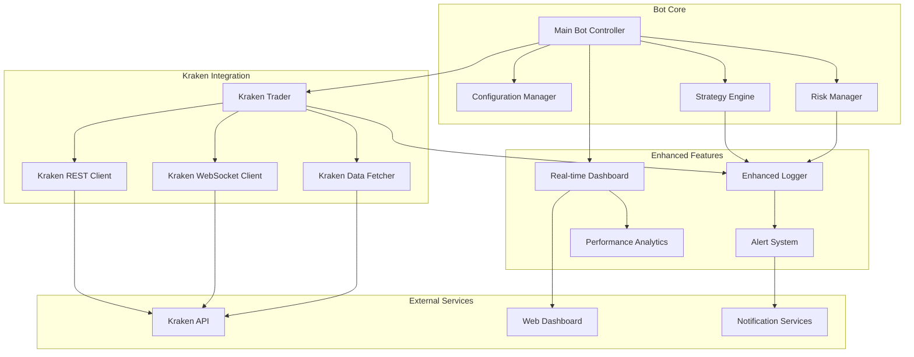
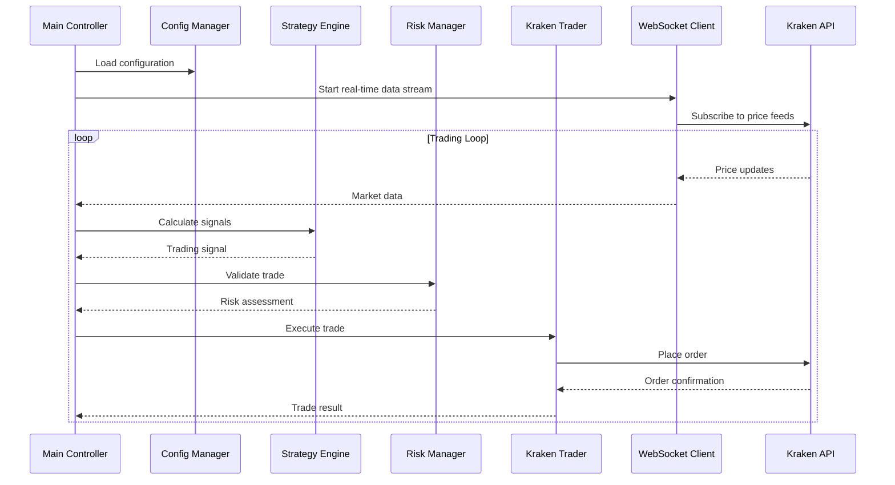

# Design Document

## Overview

This design outlines the migration of the crypto trading bot from Coinbase/Alpaca APIs to Kraken API while enhancing existing features. The migration will leverage the existing Kraken client foundation and extend it with enhanced trading strategies, risk management, real-time data processing, and monitoring capabilities.

The design follows a modular architecture that preserves the existing bot structure while replacing API-specific components and enhancing core functionality. The system will support configurable trading pairs, advanced strategies, comprehensive logging, and real-time dashboard monitoring.

## Architecture

### High-Level Architecture



### Component Interaction Flow



## Components and Interfaces

### 1. Enhanced Kraken Client

**Purpose**: Extended REST API client with advanced features
**Location**: `bot/kraken_client.py` (enhanced)

**Key Enhancements**:
- Advanced order types (stop-loss, take-profit, trailing stops)
- Batch operations for multiple pairs
- Enhanced error handling with circuit breaker pattern
- Rate limiting with intelligent throttling
- Connection pooling and session management

**Interface**:
```python
class EnhancedKrakenClient(KrakenClient):
    def place_stop_loss_order(self, pair: str, side: str, volume: str, stop_price: str) -> Dict
    def place_take_profit_order(self, pair: str, side: str, volume: str, limit_price: str) -> Dict
    def place_trailing_stop_order(self, pair: str, side: str, volume: str, trail_amount: str) -> Dict
    def get_multi_pair_ticker(self, pairs: List[str]) -> Dict
    def batch_cancel_orders(self, order_ids: List[str]) -> Dict
    def get_trading_fees(self, pairs: List[str]) -> Dict
```

### 2. Kraken WebSocket Client

**Purpose**: Real-time market data and order updates
**Location**: `bot/kraken_websocket.py` (new)

**Features**:
- Real-time price feeds for multiple pairs
- Order book updates
- Trade execution notifications
- Connection management with auto-reconnect
- Message queuing and buffering

**Interface**:
```python
class KrakenWebSocketClient:
    def __init__(self, credentials: KrakenCredentials, callback_handler: WebSocketCallbackHandler)
    def connect(self) -> bool
    def subscribe_ticker(self, pairs: List[str]) -> bool
    def subscribe_orderbook(self, pairs: List[str], depth: int = 10) -> bool
    def subscribe_trades(self, pairs: List[str]) -> bool
    def subscribe_orders(self) -> bool  # Private channel for order updates
    def unsubscribe(self, subscription_id: str) -> bool
    def disconnect(self) -> None
```

### 3. Enhanced Trading Strategies

**Purpose**: Advanced trading algorithms with multiple indicators
**Location**: `bot/enhanced_strategies.py` (enhanced)

**New Strategies**:
- Momentum-based strategies with volatility adjustment
- Multi-timeframe analysis
- Volume-weighted strategies
- Bollinger Bands with RSI confirmation
- MACD with signal line crossovers

**Interface**:
```python
class EnhancedStrategyEngine:
    def __init__(self, strategies: List[BaseStrategy], config: StrategyConfig)
    def add_strategy(self, strategy: BaseStrategy, weight: float) -> None
    def remove_strategy(self, strategy_name: str) -> bool
    def calculate_weighted_signal(self, market_data: MarketData) -> TradingSignal
    def backtest_strategy(self, historical_data: pd.DataFrame, strategy: BaseStrategy) -> BacktestResult
    def optimize_parameters(self, strategy: BaseStrategy, data: pd.DataFrame) -> Dict
```

### 4. Advanced Risk Management

**Purpose**: Portfolio-level risk control and position management
**Location**: `bot/enhanced_risk_manager.py` (enhanced)

**Features**:
- Dynamic position sizing based on volatility
- Portfolio-level exposure limits
- Correlation-based risk assessment
- Drawdown protection
- Emergency stop mechanisms

**Interface**:
```python
class EnhancedRiskManager:
    def __init__(self, config: RiskConfig, portfolio_manager: PortfolioManager)
    def validate_trade(self, signal: TradingSignal, current_positions: Dict) -> RiskAssessment
    def calculate_position_size(self, signal: TradingSignal, account_balance: float, volatility: float) -> float
    def check_portfolio_risk(self, positions: Dict, market_data: Dict) -> PortfolioRisk
    def should_emergency_stop(self, portfolio_metrics: PortfolioMetrics) -> bool
    def adjust_for_correlation(self, new_position: Position, existing_positions: List[Position]) -> float
```

### 5. Enhanced Data Management

**Purpose**: Efficient market data processing and storage
**Location**: `bot/enhanced_data_manager.py` (new)

**Features**:
- Multi-pair data synchronization
- Historical data caching
- Real-time indicator calculations
- Data validation and cleaning
- Performance metrics calculation

**Interface**:
```python
class EnhancedDataManager:
    def __init__(self, pairs: List[str], cache_config: CacheConfig)
    def add_market_data(self, pair: str, data: MarketData) -> None
    def get_latest_data(self, pair: str, periods: int = 100) -> pd.DataFrame
    def calculate_indicators(self, pair: str, indicators: List[str]) -> Dict
    def get_historical_data(self, pair: str, start_time: datetime, end_time: datetime) -> pd.DataFrame
    def validate_data_quality(self, data: pd.DataFrame) -> DataQualityReport
```

### 6. Enhanced Logging System

**Purpose**: Comprehensive logging with structured data
**Location**: `bot/enhanced_logger.py` (enhanced)

**Features**:
- Structured JSON logging
- Performance metrics tracking
- Trade execution logging
- Error categorization and alerting
- Log rotation and archiving

**Interface**:
```python
class EnhancedLogger:
    def __init__(self, config: LoggingConfig)
    def log_trade(self, trade: TradeExecution) -> None
    def log_signal(self, signal: TradingSignal, execution_result: TradeResult) -> None
    def log_performance_metrics(self, metrics: PerformanceMetrics) -> None
    def log_error(self, error: Exception, context: Dict, severity: ErrorSeverity) -> None
    def log_system_health(self, health_metrics: SystemHealth) -> None
    def generate_daily_report(self, date: datetime) -> DailyReport
```

### 7. Alert and Notification System

**Purpose**: Real-time alerts for trading events and system status
**Location**: `bot/enhanced_alerts.py` (enhanced)

**Features**:
- Multi-channel notifications (email, webhook, console)
- Alert prioritization and throttling
- Custom alert rules and conditions
- Performance-based alerts
- System health monitoring

**Interface**:
```python
class EnhancedAlertSystem:
    def __init__(self, config: AlertConfig, notification_channels: List[NotificationChannel])
    def add_alert_rule(self, rule: AlertRule) -> None
    def send_trade_alert(self, trade: TradeExecution) -> None
    def send_performance_alert(self, metrics: PerformanceMetrics) -> None
    def send_system_alert(self, alert_type: SystemAlertType, message: str, severity: AlertSeverity) -> None
    def send_risk_alert(self, risk_event: RiskEvent) -> None
    def configure_alert_throttling(self, alert_type: str, max_frequency: int) -> None
```

### 8. Real-time Dashboard

**Purpose**: Web-based monitoring and control interface
**Location**: `bot/enhanced_dashboard.py` (enhanced)

**Features**:
- Real-time portfolio visualization
- Live trading activity feed
- Performance charts and metrics
- Risk monitoring displays
- Manual trading controls

**Interface**:
```python
class EnhancedDashboard:
    def __init__(self, config: DashboardConfig, data_manager: EnhancedDataManager)
    def start_server(self, host: str = "localhost", port: int = 8080) -> None
    def update_portfolio_data(self, portfolio: Portfolio) -> None
    def update_market_data(self, market_data: Dict) -> None
    def add_trade_event(self, trade: TradeExecution) -> None
    def update_performance_metrics(self, metrics: PerformanceMetrics) -> None
    def handle_manual_trade_request(self, request: ManualTradeRequest) -> TradeResult
```

## Data Models

### Core Data Structures

```python
@dataclass
class KrakenTradingPair:
    """Enhanced trading pair configuration"""
    symbol: str
    base_currency: str
    quote_currency: str
    min_order_size: float
    price_precision: int
    size_precision: int
    maker_fee: float
    taker_fee: float
    enabled: bool = True

@dataclass
class EnhancedTradingConfig:
    """Enhanced trading configuration"""
    trading_pairs: List[KrakenTradingPair]
    default_trade_amount_usd: float
    max_position_per_pair_usd: float
    max_total_position_usd: float
    risk_per_trade_pct: float
    max_daily_trades: int
    strategy_weights: Dict[str, float]
    enable_stop_loss: bool = True
    enable_take_profit: bool = True
    emergency_stop_loss_pct: float = 0.10

@dataclass
class MarketData:
    """Real-time market data structure"""
    pair: str
    timestamp: datetime
    price: float
    volume: float
    bid: float
    ask: float
    spread: float
    volatility: Optional[float] = None

@dataclass
class TradeExecution:
    """Trade execution record"""
    trade_id: str
    pair: str
    side: str
    order_type: str
    volume: float
    price: float
    fee: float
    timestamp: datetime
    strategy: str
    signal_confidence: float
    execution_time_ms: int
    status: str

@dataclass
class PortfolioMetrics:
    """Portfolio performance metrics"""
    total_value_usd: float
    unrealized_pnl: float
    realized_pnl: float
    daily_pnl: float
    win_rate: float
    sharpe_ratio: float
    max_drawdown: float
    total_trades: int
    successful_trades: int
    average_trade_duration: float
```

## Error Handling

### Error Categories and Responses

1. **API Errors**
   - Rate limiting: Exponential backoff with jitter
   - Authentication: Credential refresh and retry
   - Network errors: Circuit breaker pattern
   - Invalid requests: Request validation and correction

2. **Trading Errors**
   - Insufficient funds: Position size adjustment
   - Invalid orders: Order parameter validation
   - Market closed: Queue orders for market open
   - Price slippage: Slippage tolerance checks

3. **System Errors**
   - Memory issues: Garbage collection and data cleanup
   - Database errors: Fallback to in-memory storage
   - WebSocket disconnections: Auto-reconnect with backoff
   - Configuration errors: Default value fallbacks

### Error Recovery Strategies

```python
class ErrorRecoveryManager:
    def __init__(self, config: ErrorRecoveryConfig):
        self.circuit_breakers = {}
        self.retry_policies = {}
        self.fallback_strategies = {}
    
    def handle_api_error(self, error: APIError, context: Dict) -> RecoveryAction
    def handle_trading_error(self, error: TradingError, context: Dict) -> RecoveryAction
    def handle_system_error(self, error: SystemError, context: Dict) -> RecoveryAction
    def should_emergency_stop(self, error_history: List[Error]) -> bool
```

## Testing Strategy

### Test Coverage Areas

1. **Unit Tests**
   - Individual component functionality
   - Data model validation
   - Strategy calculations
   - Risk management rules

2. **Integration Tests**
   - Kraken API integration
   - WebSocket connectivity
   - Database operations
   - Alert system functionality

3. **End-to-End Tests**
   - Complete trading workflows
   - Error recovery scenarios
   - Performance under load
   - Multi-pair trading scenarios

4. **Mock Trading Tests**
   - Strategy backtesting
   - Risk scenario testing
   - Performance validation
   - System stress testing

### Test Implementation

```python
class KrakenIntegrationTestSuite:
    def test_api_authentication(self)
    def test_order_placement_and_cancellation(self)
    def test_websocket_connectivity(self)
    def test_multi_pair_data_handling(self)
    def test_error_recovery_scenarios(self)
    def test_performance_under_load(self)

class TradingStrategyTestSuite:
    def test_signal_generation_accuracy(self)
    def test_risk_management_compliance(self)
    def test_portfolio_rebalancing(self)
    def test_emergency_stop_triggers(self)
```

## Performance Considerations

### Optimization Strategies

1. **Data Processing**
   - Efficient pandas operations for indicator calculations
   - Caching of frequently accessed data
   - Asynchronous data fetching
   - Memory-efficient data structures

2. **API Interactions**
   - Connection pooling for REST requests
   - WebSocket message batching
   - Request deduplication
   - Intelligent rate limiting

3. **Real-time Processing**
   - Event-driven architecture
   - Non-blocking I/O operations
   - Efficient message queuing
   - Parallel processing for multiple pairs

### Scalability Design

- Modular architecture for easy horizontal scaling
- Database abstraction for different storage backends
- Configurable resource limits
- Monitoring and alerting for performance metrics

## Security Considerations

### API Security
- Secure credential storage with encryption
- API key rotation support
- Request signing validation
- Network security with HTTPS/WSS

### System Security
- Input validation and sanitization
- Secure logging (no sensitive data)
- Access control for dashboard
- Audit trail for all trading actions

### Risk Management Security
- Position limit enforcement
- Emergency stop mechanisms
- Unauthorized access prevention
- Data integrity validation