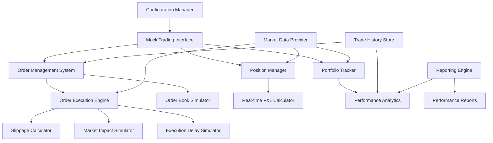

# Design Document

## Overview

The Mock Trading Environment is designed as a comprehensive paper trading simulator that provides a realistic testing environment for cryptocurrency trading strategies. The system mimics Alpaca's API behavior while maintaining complete isolation from real trading accounts. It uses real market data to ensure realistic testing conditions while simulating all aspects of trade execution, position management, and portfolio tracking.

The architecture follows a plugin-based approach, allowing seamless integration with existing trading strategies through interface compatibility. The mock environment maintains state persistence, provides detailed analytics, and supports various market condition simulations.

## Architecture

### High-Level Architecture



### Component Integration Flow

1. **Initialization**: Configuration manager loads simulation parameters and initializes mock environment
2. **Market Data**: Real market data flows into position tracking and execution systems
3. **Order Processing**: Orders are validated, processed through execution simulation, and recorded
4. **Position Updates**: Successful trades update positions and trigger P&L calculations
5. **Analytics**: Trade history and position data feed into performance analytics and reporting

## Components and Interfaces

### 1. Mock Trading Interface (mock_trader.py)

**Purpose**: Primary interface that mimics Alpaca's trading API for seamless integration

**Key Classes**:
- `MockTrader`: Main trading interface compatible with existing trader
- `MockAlpacaAPI`: Simulated API responses matching Alpaca's format
- `MockCredentials`: Placeholder credentials for mock environment

**Interface**:
```python
class MockTrader:
    def __init__(self, config: MockTradingConfig)
    def execute_trade(self, signal: TradingSignal) -> TradeResult
    def place_buy_order(self, symbol: str, quantity: float) -> Order
    def place_sell_order(self, symbol: str, quantity: float) -> Order
    def get_current_position(self, symbol: str) -> Position
    def get_portfolio_value(self) -> float
    def get_cash_balance(self) -> float
    def validate_order(self, order: Order) -> bool
```

### 2. Order Management System (order_manager.py)

**Purpose**: Handle order lifecycle, validation, and execution coordination

**Key Classes**:
- `OrderManager`: Orchestrates order processing and tracking
- `OrderValidator`: Validates orders against available funds and position limits
- `OrderBook`: Maintains pending orders and execution queue

**Interface**:
```python
class OrderManager:
    def __init__(self, portfolio: Portfolio, config: MockTradingConfig)
    def submit_order(self, order: Order) -> OrderResult
    def cancel_order(self, order_id: str) -> bool
    def get_pending_orders(self) -> List[Order]
    def process_market_update(self, price_data: MarketData)
    def execute_pending_orders(self, current_price: float)
```

### 3. Order Execution Engine (execution_engine.py)

**Purpose**: Simulate realistic order execution with slippage, delays, and market impact

**Key Classes**:
- `ExecutionEngine`: Core execution logic and simulation
- `SlippageCalculator`: Calculate realistic slippage based on order size and volatility
- `MarketImpactSimulator`: Simulate market impact for large orders
- `ExecutionDelaySimulator`: Add realistic execution delays

**Interface**:
```python
class ExecutionEngine:
    def __init__(self, config: ExecutionConfig)
    def execute_market_order(self, order: Order, current_price: float) -> ExecutionResult
    def execute_limit_order(self, order: Order, current_price: float) -> ExecutionResult
    def calculate_execution_price(self, order: Order, market_price: float) -> float
    def simulate_execution_delay(self, order: Order) -> float
    def apply_market_impact(self, order: Order, base_price: float) -> float
```

### 4. Position Manager (position_manager.py)

**Purpose**: Track positions, calculate P&L, and maintain portfolio state

**Key Classes**:
- `PositionManager`: Manage individual positions and aggregated portfolio
- `Position`: Enhanced position tracking with cost basis and P&L
- `PnLCalculator`: Real-time and realized P&L calculations

**Interface**:
```python
class PositionManager:
    def __init__(self, starting_cash: float)
    def update_position(self, trade: TradeResult)
    def get_position(self, symbol: str) -> Position
    def get_all_positions(self) -> Dict[str, Position]
    def calculate_portfolio_value(self, market_prices: Dict[str, float]) -> float
    def get_unrealized_pnl(self, market_prices: Dict[str, float]) -> float
    def get_realized_pnl(self) -> float
```

### 5. Performance Analytics (analytics.py)

**Purpose**: Calculate trading performance metrics and generate reports

**Key Classes**:
- `PerformanceAnalyzer`: Calculate key performance metrics
- `TradeAnalyzer`: Analyze individual trade performance
- `RiskMetrics`: Calculate risk-adjusted returns and drawdown metrics

**Interface**:
```python
class PerformanceAnalyzer:
    def __init__(self, trade_history: List[TradeResult], portfolio_history: List[PortfolioSnapshot])
    def calculate_total_return(self) -> float
    def calculate_sharpe_ratio(self, risk_free_rate: float = 0.02) -> float
    def calculate_max_drawdown(self) -> float
    def calculate_win_rate(self) -> float
    def calculate_profit_factor(self) -> float
    def generate_performance_report(self) -> PerformanceReport
```

### 6. Configuration Management (mock_config.py)

**Purpose**: Manage simulation parameters and environment configuration

**Key Classes**:
- `MockTradingConfig`: Main configuration container
- `ExecutionConfig`: Order execution simulation parameters
- `MarketConfig`: Market condition simulation settings

**Interface**:
```python
class MockTradingConfig:
    def __init__(self, config_file: str = None)
    def load_config(self) -> bool
    def get_execution_config(self) -> ExecutionConfig
    def get_market_config(self) -> MarketConfig
    def get_starting_capital(self) -> float
    def validate_config(self) -> bool
```

## Data Models

### Core Data Structures

```python
@dataclass
class MockTradingConfig:
    starting_capital: float = 10000.0
    trading_fee_percent: float = 0.001  # 0.1%
    slippage_base: float = 0.0001  # 0.01%
    slippage_impact_factor: float = 0.00001
    execution_delay_min_ms: int = 100
    execution_delay_max_ms: int = 500
    market_impact_threshold: float = 1000.0
    enable_partial_fills: bool = True

@dataclass
class ExecutionResult:
    order_id: str
    executed_quantity: float
    execution_price: float
    slippage: float
    fees: float
    execution_time: datetime
    market_impact: float
    partial_fill: bool

@dataclass
class PortfolioSnapshot:
    timestamp: datetime
    cash_balance: float
    positions: Dict[str, Position]
    total_value: float
    unrealized_pnl: float
    realized_pnl: float

@dataclass
class PerformanceReport:
    total_return: float
    annualized_return: float
    sharpe_ratio: float
    max_drawdown: float
    win_rate: float
    profit_factor: float
    total_trades: int
    avg_trade_return: float
    best_trade: float
    worst_trade: float
```

### Enhanced Position Model

```python
@dataclass
class MockPosition(Position):
    entry_prices: List[float]  # Track multiple entry points
    entry_quantities: List[float]  # Track quantities at each entry
    entry_timestamps: List[datetime]  # Track entry times
    realized_pnl: float = 0.0
    fees_paid: float = 0.0
    
    def calculate_weighted_avg_price(self) -> float:
        """Calculate volume-weighted average entry price"""
        
    def add_trade(self, quantity: float, price: float, timestamp: datetime, fees: float):
        """Add a new trade to the position"""
        
    def calculate_unrealized_pnl(self, current_price: float) -> float:
        """Calculate current unrealized P&L"""
```

## Error Handling

### Error Categories and Simulation

1. **Order Validation Errors**:
   - Insufficient funds: Reject orders exceeding available cash
   - Invalid quantities: Handle fractional share restrictions
   - Position limits: Enforce maximum position size limits
   - Market hours: Simulate extended hours trading restrictions

2. **Execution Simulation Errors**:
   - Partial fills: Simulate incomplete order execution
   - Price gaps: Handle limit orders during market gaps
   - Liquidity constraints: Simulate low liquidity scenarios
   - System delays: Simulate temporary execution system failures

3. **Data and State Errors**:
   - Stale market data: Handle delayed or missing price updates
   - Position reconciliation: Detect and correct position tracking errors
   - Portfolio consistency: Ensure cash and position balances remain consistent
   - Historical data gaps: Handle missing historical data gracefully

### Error Recovery and Logging

```python
class MockTradingErrorHandler:
    def __init__(self, logger: TradingLogger)
    def handle_order_rejection(self, order: Order, reason: str) -> OrderResult
    def handle_execution_failure(self, order: Order, error: Exception) -> ExecutionResult
    def handle_data_inconsistency(self, context: str, details: Dict) -> bool
    def log_simulation_event(self, event_type: str, details: Dict)
```

## Testing Strategy

### Unit Testing Approach

1. **Component Testing**:
   - Mock trader interface compatibility with existing strategies
   - Order execution simulation accuracy and consistency
   - Position tracking and P&L calculation correctness
   - Performance analytics calculation validation

2. **Integration Testing**:
   - End-to-end trading cycle simulation
   - Strategy integration without code changes
   - Market data integration and processing
   - Configuration loading and validation

3. **Scenario Testing**:
   - Various market conditions (high volatility, low liquidity)
   - Edge cases (market gaps, partial fills, order rejections)
   - Performance under different trading frequencies
   - Long-running simulation stability

### Test Data and Fixtures

```python
# Test organization
tests/
├── unit/
│   ├── test_mock_trader.py
│   ├── test_order_manager.py
│   ├── test_execution_engine.py
│   ├── test_position_manager.py
│   └── test_analytics.py
├── integration/
│   ├── test_strategy_integration.py
│   ├── test_market_data_integration.py
│   └── test_performance_simulation.py
├── scenarios/
│   ├── test_high_volatility.py
│   ├── test_market_gaps.py
│   └── test_liquidity_constraints.py
└── fixtures/
    ├── sample_trades.json
    ├── market_scenarios.json
    └── performance_benchmarks.json
```

## Performance Considerations

### Simulation Efficiency

1. **Memory Management**:
   - Efficient storage of trade history and portfolio snapshots
   - Configurable history retention limits
   - Lazy loading of historical performance data

2. **Execution Speed**:
   - Optimized order matching algorithms
   - Cached market data for repeated simulations
   - Parallel processing for multiple strategy testing

3. **Scalability**:
   - Support for multiple concurrent simulations
   - Configurable simulation complexity levels
   - Resource usage monitoring and limits

### Real-time Simulation

```python
class SimulationOptimizer:
    def __init__(self, config: OptimizationConfig)
    def optimize_execution_simulation(self, order_volume: int) -> ExecutionConfig
    def cache_market_data(self, symbol: str, timeframe: str, duration: timedelta)
    def cleanup_old_data(self, retention_days: int)
    def monitor_memory_usage(self) -> ResourceUsage
```

## Integration Points

### Existing System Integration

1. **Strategy Compatibility**:
   - Drop-in replacement for live trader
   - Same interface contracts and return types
   - Configuration-based switching between mock and live

2. **Data Source Integration**:
   - Use existing market data fetchers
   - Compatible with current data validation
   - Support for both real-time and historical data

3. **Logging and Monitoring**:
   - Integration with existing logging system
   - Enhanced logging for simulation-specific events
   - Performance tracking and reporting

### Configuration Integration

```python
# Example configuration switching
class TradingEnvironmentFactory:
    @staticmethod
    def create_trader(config: Config) -> Union[Trader, MockTrader]:
        if config.use_mock_trading:
            return MockTrader(config.mock_config)
        else:
            return Trader(config.alpaca_credentials)
```

## Security and Safety

### Simulation Safety

1. **Isolation Guarantees**:
   - Complete isolation from live trading systems
   - No network calls to actual trading APIs
   - Clear simulation mode indicators in all outputs

2. **Data Protection**:
   - No real credentials required or stored
   - Simulation data clearly marked and separated
   - Safe defaults for all configuration parameters

3. **Testing Safety**:
   - Comprehensive validation of mock vs live behavior
   - Automated tests to ensure API compatibility
   - Clear documentation of simulation limitations