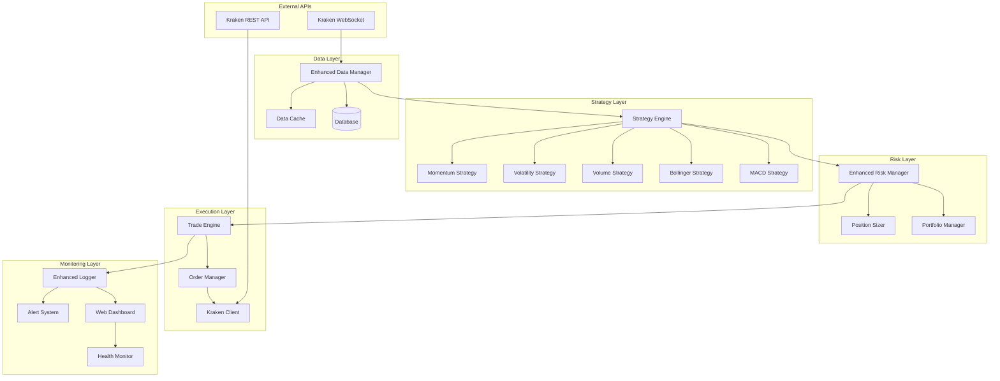

# Developer Guide for Enhanced Kraken Trading Bot

This comprehensive guide provides information for developers who want to contribute to, extend, or customize the Enhanced Kraken Trading Bot.

## Table of Contents

1. [Architecture Overview](#architecture-overview)
2. [Core Components](#core-components)
3. [Adding New Strategies](#adding-new-strategies)
4. [Extending Risk Management](#extending-risk-management)
5. [Custom Indicators](#custom-indicators)
6. [WebSocket Integration](#websocket-integration)
7. [Dashboard Development](#dashboard-development)
8. [Testing Framework](#testing-framework)
9. [Performance Optimization](#performance-optimization)
10. [Deployment and Monitoring](#deployment-and-monitoring)

## Architecture Overview

The Enhanced Kraken Trading Bot follows a modular, event-driven architecture:

```
bot/
├── main.py                    # Main orchestrator
├── config.py                  # Configuration management
├── kraken_client.py          # Enhanced Kraken REST API client
├── kraken_websocket.py       # Real-time WebSocket client
├── kraken_trader.py          # Trade execution engine
├── enhanced_strategies.py     # Advanced trading strategies
├── enhanced_risk_manager.py   # Portfolio risk management
├── enhanced_data_manager.py   # Market data processing
├── enhanced_logger.py         # Structured logging system
├── enhanced_alerts.py         # Multi-channel alert system
├── enhanced_dashboard.py      # Real-time web dashboard
└── utils.py                  # Utility functions
```

### System Architecture Diagram



## Core Components

### Configuration (config.py)

The configuration module handles loading and validating settings from environment variables and command-line arguments. It provides two main classes:

- `AlpacaCredentials`: Stores API credentials for Alpaca
- `TradingSettings`: Stores trading parameters like symbol, amounts, and limits

### Data Fetcher (data_fetcher.py)

The data fetcher is responsible for retrieving market data from the Alpaca API. It handles:

- Fetching historical price data for backtesting
- Getting real-time price data for live trading
- Managing API rate limits with exponential backoff

### Trading Strategies (strategy.py)

The strategy module defines the interface for trading strategies and provides implementations for:

- Moving Average Crossover strategy
- RSI (Relative Strength Index) strategy

Each strategy implements the `calculate_signals` method that analyzes market data and returns trading signals.

### Trader (trader.py)

The trader module handles the execution of trades based on signals. It includes:

- Order creation and submission
- Position management
- Stop loss and take profit handling
- Paper trading mode

### Scheduler (scheduler.py)

The scheduler manages the timing of trading cycles. It:

- Runs trading cycles at specified intervals
- Handles graceful startup and shutdown
- Manages health checks

### Logger (logger.py)

The logger provides comprehensive logging and a real-time dashboard. It includes:

- Console logging with color coding
- File-based logging for trades, signals, and errors
- Real-time dashboard display using the rich library

### Error Handler (error_handler.py)

The error handler provides robust error recovery mechanisms:

- Exponential backoff for API rate limits
- Automatic retry for transient errors
- Graceful degradation for persistent issues

## Extending the Bot

### Adding a Custom Strategy

To add a custom trading strategy:

1. Create a new class that inherits from `BaseStrategy` in `bot/strategy.py` or in a new file
2. Implement the `calculate_signals` method to generate trading signals
3. Add your strategy to the `strategies` list in `bot/main.py`

Example:

```python
from bot.strategy import BaseStrategy

class CustomStrategy(BaseStrategy):
    def __init__(self, param1=10, param2=20):
        self.param1 = param1
        self.param2 = param2
        self.name = "CustomStrategy"
        
    def calculate_signals(self, data):
        # Implement your strategy logic here
        # Return a dictionary with signal information
        return {
            'action': 'BUY',  # or 'SELL' or 'HOLD'
            'confidence': 0.8,
            'strategy': self.name,
            'reasoning': 'Custom strategy reasoning'
        }
```

Then in `bot/main.py`:

```python
from your_module import CustomStrategy

# Add to the strategies list
strategies: List[BaseStrategy] = [
    MovingAverageCrossover(...),
    RSIStrategy(...),
    CustomStrategy(param1=15, param2=25)
]
```

### Adding Command-line Options

To add new command-line options:

1. Add the option to the `parse_arguments` function in `bot/main.py`
2. Update the `update_trading_settings` function to handle the new option
3. Use the option in your code

Example:

```python
# In parse_arguments()
parser.add_argument(
    "--custom-param",
    type=int,
    default=10,
    help="Custom parameter for your strategy (default: 10)"
)

# In update_trading_settings()
settings.custom_param = args.custom_param

# In initialize_components()
custom_strategy = CustomStrategy(param1=args.custom_param)
```

### Modifying the Dashboard

To modify the dashboard display:

1. Update the `_create_layout` method in `bot/logger.py` to change the layout structure
2. Modify the `update_live_display` method to change what data is displayed
3. Add new methods to update additional data points

## Testing

The bot includes a comprehensive test suite:

- Unit tests in `tests/unit/` test individual components in isolation
- Integration tests in `tests/integration/` test the interaction between components

To run the tests:

```bash
# Run all tests
pytest

# Run unit tests only
pytest tests/unit/

# Run integration tests only
pytest tests/integration/

# Run tests with coverage report
pytest --cov=bot
```

## Logging

The bot uses Python's built-in logging module with custom handlers:

- Console logging with color coding using the rich library
- File-based logging for different types of events

Log levels:

- DEBUG: Detailed debugging information
- INFO: Confirmation that things are working as expected
- WARNING: Indication that something unexpected happened
- ERROR: Due to a more serious problem, the software has not been able to perform some function
- CRITICAL: A serious error, indicating that the program itself may be unable to continue running

## Error Handling

The bot includes robust error handling mechanisms:

- `retry_with_backoff` decorator in `bot/utils.py` for retrying operations with exponential backoff
- Error logging and reporting through the logger
- Graceful degradation for non-critical errors

## Performance Considerations

- The bot is designed to run with minimal resource usage
- API calls are rate-limited to avoid hitting API limits
- Long-running operations are performed asynchronously where possible
- The dashboard updates are throttled to avoid excessive CPU usage

## Security Considerations

- API credentials are loaded from environment variables, not hardcoded
- The bot supports paper trading mode for testing without real money
- Error logs do not include sensitive information
- Input validation is performed on all user inputs

## Contributing

When contributing to the project:

1. Follow the existing code style and conventions
2. Add tests for new functionality
3. Update documentation to reflect changes
4. Use type hints for better code readability and IDE support
5. Handle errors gracefully with appropriate logging